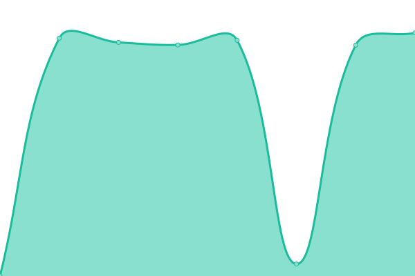
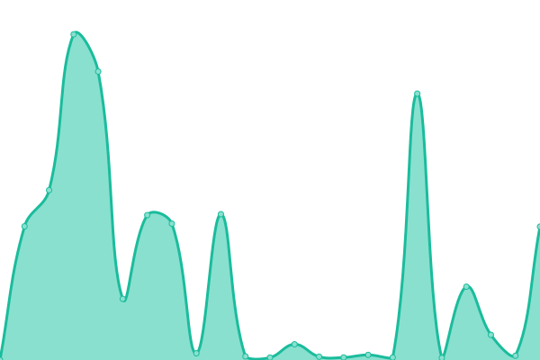

# [📈 Live Status](https://ASJordi.github.io/website-activity-status): <!--live status--> **🟧 Partial outage**

This repository contains the open-source uptime monitor and status page for [Jordi Ayala](asjordi.dev), powered by [Upptime](https://github.com/upptime/upptime).

With [Upptime](https://upptime.js.org), you can get your own unlimited and free uptime monitor and status page, powered entirely by a GitHub repository. We use [Issues](https://github.com/ASJordi/website-activity-status/issues) as incident reports, [Actions](https://github.com/ASJordi/website-activity-status/actions) as uptime monitors, and [Pages](https://ASJordi.github.io/website-activity-status) for the status page.

<!--start: status pages-->
<!-- This summary is generated by Upptime (https://github.com/upptime/upptime) -->
<!-- Do not edit this manually, your changes will be overwritten -->
<!-- prettier-ignore -->
| URL | Status | History | Response Time | Uptime |
| --- | ------ | ------- | ------------- | ------ |
|  [Website](https://asjordi.dev) | 🟩 Up | [website.yml](https://github.com/ASJordi/website-activity-status/commits/HEAD/history/website.yml) | 

 110ms
     
 | 

<a href="https://up.asjordi.dev/history/website">100.00%</a>
    

|  [Links](https://links.asjordi.dev/) | 🟩 Up | [links.yml](https://github.com/ASJordi/website-activity-status/commits/HEAD/history/links.yml) | 

 147ms
     
 | 

<a href="https://up.asjordi.dev/history/links">100.00%</a>
    

|  [URL Shortener](https://link-shortly.netlify.app) | 🟩 Up | [url-shortener.yml](https://github.com/ASJordi/website-activity-status/commits/HEAD/history/url-shortener.yml) | 

 91ms
     
 | 

<a href="https://up.asjordi.dev/history/url-shortener">100.00%</a>
    

|  [URL Shortener API](https://api-url-zgau.onrender.com/) | 🟥 Down | [url-shortener-api.yml](https://github.com/ASJordi/website-activity-status/commits/HEAD/history/url-shortener-api.yml) | 

 8089ms
     
 | 

<a href="https://up.asjordi.dev/history/url-shortener-api">95.31%</a>
    

|  [Weather App](https://weather-app-nodejs.netlify.app) | 🟩 Up | [weather-app.yml](https://github.com/ASJordi/website-activity-status/commits/HEAD/history/weather-app.yml) | 

 233ms
     
 | 

<a href="https://up.asjordi.dev/history/weather-app">100.00%</a>
    

|  [Weather App API](https://weather-app-backend-y96o.onrender.com/api/) | 🟩 Up | [weather-app-api.yml](https://github.com/ASJordi/website-activity-status/commits/HEAD/history/weather-app-api.yml) | 

 7927ms
     
 | 

<a href="https://up.asjordi.dev/history/weather-app-api">89.77%</a>
    

|  [API Words](https://simple-api-words.onrender.com) | 🟩 Up | [api-words.yml](https://github.com/ASJordi/website-activity-status/commits/HEAD/history/api-words.yml) | 

 8701ms
     
 | 

<a href="https://up.asjordi.dev/history/api-words">87.73%</a>
    

<!--end: status pages-->

[**Visit our status website →**](https://ASJordi.github.io/website-activity-status)

## 📄 License

- Powered by: [Upptime](https://github.com/upptime/upptime)
- Code: [MIT](./LICENSE) © [Jordi Ayala](asjordi.dev)
- Data in the `./history` directory: [Open Database License](https://opendatacommons.org/licenses/odbl/1-0/)
